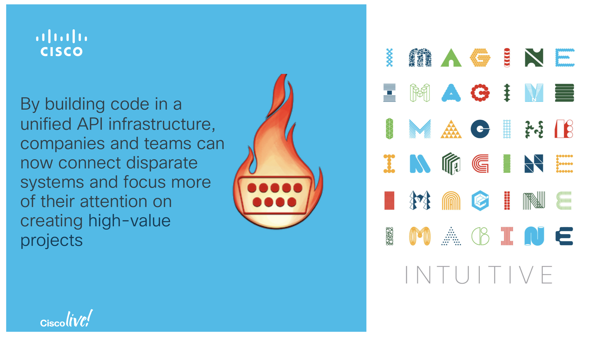

# CLEUR 2019 DEVNET 1599
Code examples used for DEVNET-1599 Network Automation Using Unified API. All testing code is designed to run on Cisco IOS XR.

# Session Abstract

|Stuart Clark, ENGINEER.SOFTWARE ENGINEERING, Cisco Systems, Inc. - Distinguished Speaker -|
|:-:|
|Network automation and device management has many paths and options. With so many APIs available, your network can quickly be as complex to manage with automation as it was with manual configurations. Evaluating the offerings of API vendors often goes past the technology itself. But, NAPALM (Network Automation and Programmability Abstraction Layer with Multivendor support) is helping to change that. NAPALM's unified API makes it possible to share code between network devices and vendors. In this session we will explore how network admins are using NAPALM to manage servers, and how cloud and applications can be leveraged in the network to promote a NetDevOps ethos within our network teams.



# Installing NAPALM and dependencies
When installing NAPALM, be sure to install the latest version (2.X) as there were fundamental changes that happened between NAPALM 1.X and 2.X. You can install NAPALM with pip:

```
python3 -m venv venv
source venv/bin/activate
python -V
Python 3.6.5
```

```
pip install -r requirements.txt
```
